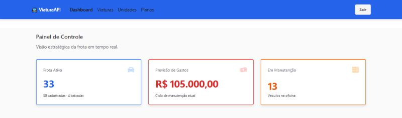
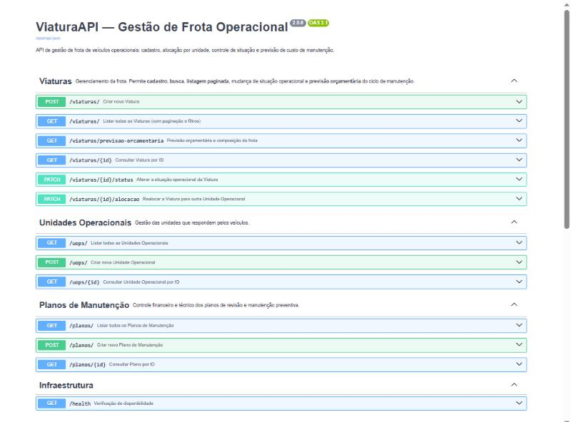

# ViaturaAPI — gestão de frota operacional

[](https://github.com/danilogep/Viatura-API/actions/workflows/ci.yml)
[](https://python.org)
[](https://fastapi.tiangolo.com)
[](LICENSE)

**O que resolve:** controla uma frota de veículos operacionais — quem está rodando, quem está na oficina, quem saiu da frota — e projeta o custo do ciclo de manutenção a partir dos planos vigentes.
**Como rodar:** `cp .env.example .env && docker compose up --build` → API em `localhost:8000/docs`, interface em `localhost:5173`.
**Interface:** [danilogep/viatura-frontend](https://github.com/danilogep/viatura-frontend) — React + TypeScript, consome esta API.
**Em um print:**



---

## Subindo tudo com um comando

A pilha inteira — Postgres, API e interface — está descrita em um único `docker-compose.yml`.

```bash
git clone https://github.com/danilogep/Viatura-API.git
git clone https://github.com/danilogep/viatura-frontend.git   # irmão, lado a lado
cd Viatura-API
cp .env.example .env
docker compose up --build
```

| Serviço | Endereço |
|---|---|
| Documentação interativa (Swagger) | http://localhost:8000/docs |
| Interface | http://localhost:5173 |
| Banco | `localhost:5432` |

Para popular o banco com 5 unidades, 4 planos e 50 viaturas:

```bash
docker compose --profile seed up seed
```

O compose espera o frontend em `../viatura-frontend`. Se ele estiver em outro lugar, ajuste `FRONTEND_PATH` no `.env`.

<details>
<summary>Rodar sem Docker</summary>

```bash
python -m venv venv && venv/Scripts/activate      # Linux/macOS: source venv/bin/activate
pip install -r requirements.txt
cp .env.example .env                              # aponte DB_URL para o seu Postgres
alembic upgrade head
python seed.py
uvicorn main:app --reload --port 8000
```
</details>

---

## A API



| Método | Rota | O que faz |
|---|---|---|
| `POST` | `/viaturas/` | Cadastra e aloca um veículo |
| `GET` | `/viaturas/` | Lista paginada, com filtro por `modelo`, `placa` e `status` |
| `GET` | `/viaturas/previsao-orcamentaria` | Composição da frota e custo previsto |
| `GET` | `/viaturas/{id}` | Consulta por ID |
| `PATCH` | `/viaturas/{id}/status` | Move entre `OPERACAO`, `MANUTENCAO` e `BAIXADA` |
| `PATCH` | `/viaturas/{id}/alocacao` | Transfere para outra unidade |
| `GET/POST` | `/uops/`, `/planos/` | Cadastros de apoio |
| `GET` | `/health` | Usado pelo healthcheck do compose |

---

## As duas decisões que sustentam o projeto

**1. Baixa é estado terminal.**

Um veículo baixado saiu da frota. Se a API permitisse realocá-lo, ele reapareceria no efetivo de uma unidade e voltaria a pesar na previsão orçamentária — exatamente o número que a baixa deveria reduzir. Então:

```http
PATCH /viaturas/7/alocacao   →  409  "Viatura ABC1D23 está baixada e não pode ser
                                      alocada a uma unidade operacional."
PATCH /viaturas/7/status     →  409  "Viatura baixada não retorna à frota:
     {"status": "OPERACAO"}            a baixa é definitiva."
```

A regra tem arquivo de teste próprio: [`tests/test_regra_viatura_baixada.py`](tests/test_regra_viatura_baixada.py).

**2. O orçamento é agregado no banco, não somado no cliente.**

A versão anterior do painel pedia a primeira página da listagem e somava o custo dos itens recebidos. Com a frota acima do tamanho da página, o número saía menor que o real e ninguém percebia. O cálculo foi para uma rota própria, em SQL:

```bash
curl localhost:8000/viaturas/previsao-orcamentaria
```
```json
{
  "total_viaturas": 50,
  "em_operacao": 33,
  "em_manutencao": 13,
  "baixadas": 4,
  "previsao_orcamentaria": 105000.0
}
```

Viatura em manutenção **continua** no orçamento — manutenção é quando o custo se realiza. Viatura baixada **sai**. Os dois casos estão travados em [`tests/test_previsao_orcamentaria.py`](tests/test_previsao_orcamentaria.py).

---

## Testes

```bash
pip install -r requirements-dev.txt
pytest --cov
```

A suíte roda contra SQLite em memória, criado e destruído por teste: **não é preciso subir banco nenhum antes.** São 35 testes cobrindo cadastro, filtros, paginação, as regras de baixa e o agregado orçamentário.

```
viatura/controller.py      76 stmts    0 miss   100%
viatura/schemas.py         47 stmts    0 miss   100%
TOTAL                     303 stmts   15 miss    95%
```

O mesmo comando roda no CI a cada push, com `--cov-fail-under=85`.

---

## Stack

| Camada | Escolha |
|---|---|
| API | FastAPI + Pydantic v2 |
| Persistência | SQLAlchemy 2.0 assíncrono + asyncpg |
| Banco | PostgreSQL 15 |
| Migrações | Alembic |
| Paginação | fastapi-pagination |
| Testes | pytest + pytest-asyncio + httpx (ASGITransport) |
| Lint | ruff |
| Empacotamento | Docker + Docker Compose |

## Configuração

Tudo por variável de ambiente; veja [`.env.example`](.env.example). Não há credencial no código nem no `docker-compose.yml`.

| Variável | Para que serve |
|---|---|
| `DB_URL` | Conexão do SQLAlchemy |
| `CORS_ORIGINS` | Origens liberadas, separadas por vírgula |
| `SQL_ECHO` | Ecoa o SQL no console (`false` por padrão) |

## Estrutura

```
main.py                  aplicação, CORS e lifespan
contrib/                 Base dos models, schemas e sessão
viatura/                 model, schemas e controller do agregado principal
unidade_operacional/     cadastro das unidades
plano_manutencao/        cadastro dos planos e seus custos
alembic/                 migrações
tests/                   suíte pytest
seed.py                  massa de desenvolvimento
```

## Licença

[MIT](LICENSE).
