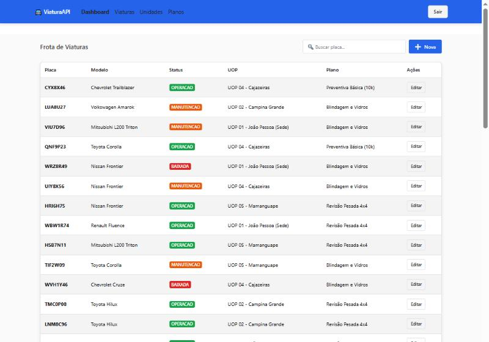
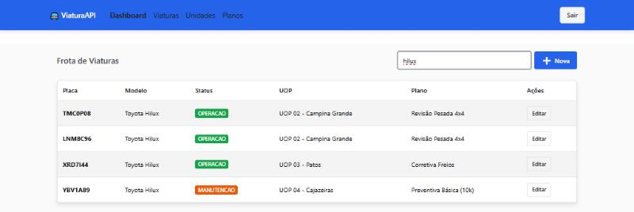

# Viatura Frontend — painel de gestão de frota

[](https://github.com/danilogep/viatura-frontend/actions/workflows/ci.yml)
[](https://react.dev/)
[](https://www.typescriptlang.org/)
[](LICENSE)

**O que resolve:** dá rosto à gestão de frota — situação de cada veículo, custo previsto do ciclo de manutenção e busca instantânea sobre a frota inteira.
**Como rodar:** `npm install && npm run dev` com a API no ar em `localhost:8000`.
**Backend:** [danilogep/Viatura-API](https://github.com/danilogep/Viatura-API) — FastAPI + PostgreSQL. O `docker compose` de lá sobe os dois de uma vez.
**Em um print:**


---

## Rodando

A forma mais curta é pelo repositório do backend, que tem um `docker compose` subindo banco, API e esta interface juntos. Para trabalhar só no frontend:

```bash
git clone https://github.com/danilogep/viatura-frontend.git
cd viatura-frontend
npm install
cp .env.example .env          # VITE_API_URL=http://localhost:8000
npm run dev
```

Abra http://localhost:5173. A API precisa estar no ar — sem ela o painel mostra um aviso em vez de números fantasiados.

| Comando | O que faz |
|---|---|
| `npm run dev` | Servidor de desenvolvimento |
| `npm run build` | `tsc -b` + bundle de produção em `dist/` |
| `npm run lint` | ESLint |
| `npm run preview` | Serve o `dist/` já construído |

---

## As telas

### Frota



A cor do badge é a leitura rápida da tabela: verde em operação, laranja na oficina, vermelho fora da frota.

### Busca instantânea



Filtra por placa ou modelo enquanto se digita, sem ida ao servidor.

### Planos de manutenção


Valores formatados em BRL com `Intl.NumberFormat` — a formatação de moeda é do navegador, não um `toFixed(2)` com `R$` colado na frente.

---

## Decisões

**O endereço da API vem do ambiente.** `VITE_API_URL` é lida em [`src/services/api.ts`](src/services/api.ts) e cai em `http://localhost:8000` quando ausente. A mesma imagem Docker serve para apontar a um backend local, de homologação ou publicado — o valor entra como build-arg, porque o Vite resolve variáveis `VITE_*` em tempo de build.

**O painel não soma no cliente.** Os números do dashboard vêm de `GET /viaturas/previsao-orcamentaria`, agregados em SQL. A versão anterior pedia a primeira página da listagem e somava os itens recebidos, o que subnotificava a previsão assim que a frota passava de 100 veículos.

**Tipos espelham o contrato da API.** [`src/types/index.ts`](src/types/index.ts) declara `StatusViatura` como união literal (`'OPERACAO' | 'MANUTENCAO' | 'BAIXADA'`), e não `string`: um status novo no backend quebra a compilação aqui, que é onde se quer descobrir.

---

## Stack

React 19 · TypeScript 5.9 · Vite 7 · Chakra UI v3 · Axios · React Router 7

Build de produção servido por nginx ([`Dockerfile`](Dockerfile)), com fallback de SPA para que um F5 em `/viaturas` não devolva 404.

## Estrutura

```
src/pages/        Dashboard, Viaturas, UOPs, Planos
src/components/   Navbar e blocos reutilizáveis
src/services/     instância do Axios
src/types/        contrato compartilhado com a API
```

## Licença

[MIT](LICENSE).
