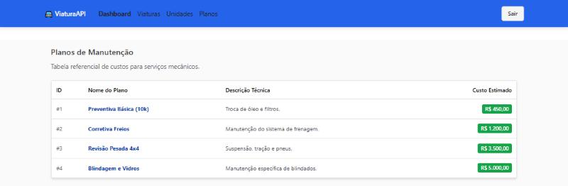

# Frontend — VIATURA

Interface de gestão de frota em **React 19, TypeScript, Vite e Chakra UI**.
Parte do [projeto unificado](../README.md), consumindo a [API Python](../backend/README.md).


## Desenvolvimento local

Requisito: Node.js 22. Partindo da raiz do repositório:

```bash
cd frontend
npm ci
cp .env.example .env
npm run dev
```

No PowerShell, use `Copy-Item .env.example .env`.
A API precisa estar acessível em `http://localhost:8000`, ou no endereço definido
em `VITE_API_URL`. A interface abre por padrão em http://localhost:5173.

## Comandos

Execute dentro de `frontend/`:

| Comando | Função |
|---|---|
| `npm run dev` | Servidor Vite de desenvolvimento |
| `npm run lint` | ESLint |
| `npx tsc --noEmit -p tsconfig.app.json` | Checagem de tipos da aplicação |
| `npm run build` | Compilação TypeScript e bundle de produção |
| `npm run preview` | Visualização local do bundle |

Para executar tudo em Docker, use o Compose na [raiz](../README.md), que constrói
esta imagem e inicia a API e o banco.

## Estrutura

```text
src/
├── pages/        Dashboard, veículos, unidades e planos
├── components/   Navegação e componentes compartilhados
├── services/     Cliente Axios e acesso à API
├── types/        Contratos TypeScript usados pela interface
├── App.tsx       Rotas da aplicação
└── main.tsx      Inicialização do React
```

## Telas e comportamento

- Dashboard: frota ativa, veículos em manutenção e previsão de gastos da API.
- Viaturas: lista, busca e situação dos veículos.
- Unidades: cadastro das unidades operacionais.
- Planos: cadastro dos planos e seus custos estimados.




Os tipos em `src/types/` representam o contrato esperado, mas não são gerados
automaticamente a partir da API. Ao mudar o contrato Python, revise-os junto com
os consumidores em `src/services/` e `src/pages/`.

## Build e configuração

`VITE_API_URL` é resolvida **durante o build** e fica pública no JavaScript.
Não use variáveis `VITE_*` para senhas ou tokens privados. Alterar o endereço
exige um novo build.

O Dockerfile compila a aplicação e entrega o resultado via nginx. O
`nginx.conf` mantém o fallback de SPA: abrir ou atualizar `/viaturas` serve
`index.html` e deixa o React resolver a rota.

## Histórico

O código do antigo repositório `viatura-frontend` foi incorporado aqui com seu
histórico Git completo. Todas as alterações futuras pertencem ao repositório
[Viatura-API](https://github.com/danilogep/Viatura-API).
